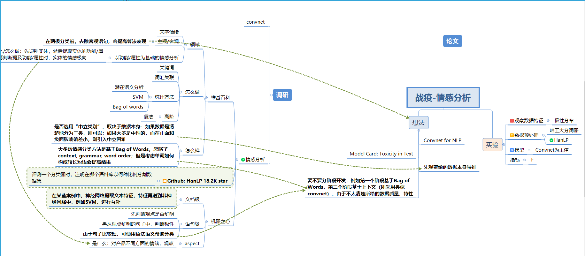

# Emotion-recognition-of-netizens-during-the-epidemic

## Mindmap

## Material

### Paper & Tutorial

1. [Tutorials on getting started with PyTorch and TorchText for sentiment analysis. ](https://github.com/bentrevett/pytorch-sentiment-analysis)
2. [A paper list for aspect based sentiment analysis. ](https://github.com/jiangqn/Aspect-Based-Sentiment-Analysis)
3. [收集NLP领域相关的数据集、论文、开源实现，尤其是情感分析、情绪原因识别](https://github.com/haiker2011/awesome-nlp-sentiment-analysis)
4. [2020 CS224N convnet for NLP](http://web.stanford.edu/class/cs224n/slides/cs224n-2020-lecture11-convnets.pdf)
5. [2020 CS224N convnet notes](http://web.stanford.edu/class/cs224n/readings/cs224n-2019-notes08-CNN.pdf)
6. [NLP Progress Sentiment Analysis](https://github.com/sebastianruder/NLP-progress/blob/master/english/sentiment_analysis.md)

### Resolution
1. [HanLp](https://github.com/hankcs/HanLP)
2. [Snownlp](https://github.com/isnowfy/snownlp)
3. [BaiduSenta](https://github.com/baidu/Senta)
4. [文本挖掘和预处理工具](https://github.com/blmoistawinde/HarvestText)
5. [CCF BDCI 2019 互联网新闻情感分析 复赛top1解决方案 ](https://github.com/cxy229/BDCI2019-SENTIMENT-CLASSIFICATION)
6. [Using Convolutional Neural Net for Sentiment Analysis ](https://github.com/Theo-/sentiment-analysis-keras-conv)
7. [“互联网新闻情感分析”赛题](https://github.com/DefuLi/Emotional-Analysis-of-Internet-News)
8. [腾讯云词法分析](https://cloud.tencent.com/document/product/271/35494)
9. [科大讯飞词法分析](https://www.xfyun.cn/doc/nlp/emotion-analysis/API.html)
10. [情感分析资源大全](https://blog.csdn.net/qq280929090/article/details/70838025)
11. [AI Challenger 2018：细粒度用户评论情感分类冠军思路总结 ](https://mp.weixin.qq.com/s/FJtMDoNksSZLYdoEzixJTQ)
