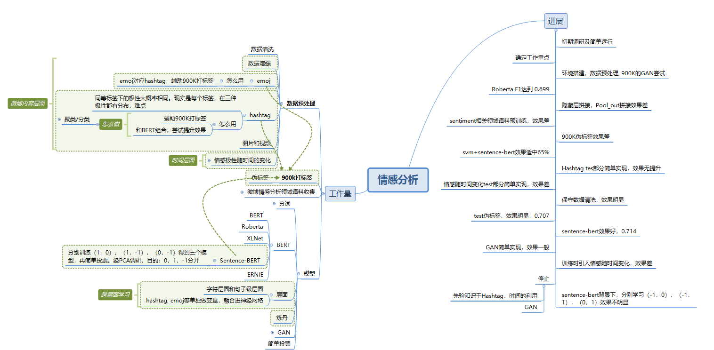

# Emotion-recognition-of-netizens-during-the-epidemic

## Mindmap

## Material

### Paper & Tutorial

1. [Tutorials on getting started with PyTorch and TorchText for sentiment analysis. ](https://github.com/bentrevett/pytorch-sentiment-analysis)
2. [A paper list for aspect based sentiment analysis. ](https://github.com/jiangqn/Aspect-Based-Sentiment-Analysis)
3. [收集NLP领域相关的数据集、论文、开源实现，尤其是情感分析、情绪原因识别](https://github.com/haiker2011/awesome-nlp-sentiment-analysis)
4. [2020 CS224N convnet for NLP](http://web.stanford.edu/class/cs224n/slides/cs224n-2020-lecture11-convnets.pdf)
5. [2020 CS224N convnet notes](http://web.stanford.edu/class/cs224n/readings/cs224n-2019-notes08-CNN.pdf)
6. [NLP Progress Sentiment Analysis](https://github.com/sebastianruder/NLP-progress/blob/master/english/sentiment_analysis.md)
7. [The Illustrated BERT, ELMo, and co](http://jalammar.github.io/illustrated-bert/)

### Resolution

1. [CCF BDCI 2019 互联网新闻情感分析 复赛top1解决方案 ](https://github.com/cxy229/BDCI2019-SENTIMENT-CLASSIFICATION)
2. [AI Challenger 2018：细粒度用户评论情感分类冠军思路总结 ](https://mp.weixin.qq.com/s/FJtMDoNksSZLYdoEzixJTQ)
3. [“互联网新闻情感分析”赛题](https://github.com/DefuLi/Emotional-Analysis-of-Internet-News)

### Data Augmentation

1. [EDA 论文阅读](https://www.ctolib.com/zhanlaoban-eda_nlp_for_Chinese.html)
2. [Unsupervised Data Augmentation ](https://github.com/google-research/uda)
3. [Data augmentation for NLP](https://github.com/makcedward/nlpaug)
4. [Easy Data Augmentation for NLP on Chinese ](https://github.com/gmftbyGMFTBY/EDA-NLP-Chinese)

### Lexical analysis

1. [HanLp](https://github.com/hankcs/HanLP)
2. [Snownlp](https://github.com/isnowfy/snownlp)
3. [BaiduSenta](https://github.com/baidu/Senta)
4. [文本挖掘和预处理工具](https://github.com/blmoistawinde/HarvestText)
5. [腾讯云词法分析](https://cloud.tencent.com/document/product/271/35494)
6. [科大讯飞词法分析](https://www.xfyun.cn/doc/nlp/emotion-analysis/API.html)

### Pretraining

1. [Mapping a variable-length sentence to a fixed-length vector using BERT model ](https://github.com/hanxiao/bert-as-service)
2. [中文预训练BERT-wwm](https://github.com/ymcui/Chinese-BERT-wwm)
3. [中文预训练RoBERTa模型](https://github.com/brightmart/roberta_zh)
4. [CCF-BDCI-Sentiment-Analysis-Baseline](https://github.com/guoday/CCF-BDCI-Sentiment-Analysis-Baseline)
5. [Bert base Chinese](https://github.com/google-research/bert)
6. [ERNIE](https://github.com/PaddlePaddle/ERNIE/blob/develop/README.zh.md)

### Hashtag

1. [Hashtag研究综述](http://manu44.magtech.com.cn/Jwk_infotech_wk3/article/2015/1003-3513/1003-3513-31-10-40.html#close)
2. [Utilizing Hashtags for Sentiment Analysis of Tweets in T hePolitical Domain ](https://sci-hub.tw/10.1145/3055635.3056631)

### Text Classification

1. [文本分类综述](https://zhuanlan.zhihu.com/p/76003775)

### Time Series

1. [Sentiment Analysis on Time-Series Data Using Weight Priority Method on Deep Learning](https://ieeexplore.ieee.org/document/8816985)
2. [Real Time Sentiment Change Detection of Twitter Data Streams](Real Time Sentiment Change Detection of Twitter Data Streams)

### Misc

1. [Using Convolutional Neural Net for Sentiment Analysis ](https://github.com/Theo-/sentiment-analysis-keras-conv)
2. [情感分析资源大全](https://blog.csdn.net/qq280929090/article/details/70838025)

### 赛后总结

1. [datafountain-sentiment-recognition](https://github.com/JOHNYXUU/datafountain-sentiment-recognition)
2. [疫情期间网民情绪识别】比赛全面复盘](https://www.shangyexinzhi.com/article/1687497.html)

## 数据预处理

### I/O
1. 新增三个数据类可以快速将数据读入DataFrame中, 并格式化日期 \
这三个数据类为：LabeledDataset、UnlabeledDataset、Testset \
将中文标题重命名为：
    - 微博id -> ID(主键)
    - 微博发布时间 -> datetime
    - 发布人账号 -> poster
    - 微博中文内容 -> content
    - 微博图片 -> image
    - 微博视频 -> video
    - 情感倾向 -> sentiment
2. 新增生成测试数据集的排行榜提交文件函数submit，实现了ID号后需加空格的坑人逻辑
3. 测试集TestDataset新增fill_result函数，可以用来填充模型训练的结果
4. 实现900K抽样并添加伪标签

### 数据清洗

1. 访问数据集属性cleaned_data可以执行多进程加速的清洗步骤并获得清洗过的数据集，若cleaned_data是第二次访问，则无需执行清洗步骤，已实现的清洗步骤为：
    - 去除微博末尾的无意义的文字
    - 去除@回复中的微博名称及hashtag、【】中的内容
    - 繁体中文转简体中文
    
### 统计
1. 属性stat_hashtags用来提取不与微博关联的所有hashtag与该hashtag出现的次数
